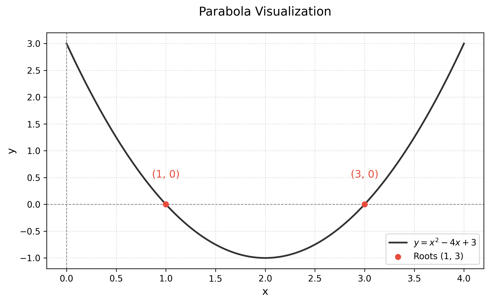

# The Quadratic Formula
## Making the Boring Beautiful


---

## The Formula


The quadratic formula is universally used to find the roots of a second-degree polynomial equation:


$$
\Delta = b^2 - 4ac
$$


$$
x = \frac{-b \pm \sqrt{\Delta}}{2a}
$$

> [](#i) **Roots**
> The roots are the values of $x$ that satisfy the equation $ax^2 + bx + c = 0$.


---

## Curiosity: The "Bhaskara" Name

### 🇧🇷 🇮🇳 **Brazilian Uniqueness** 🪇 🥻

- In Brazil, this formula is widely known as "Bhaskara's Formula", named after the 12th-century Indian mathematician Bhaskara II.

- Interestingly, this naming convention is unique to Brazil; in the rest of the world, it's simply the "Quadratic Formula".


---

## Visualizing Roots

The roots are the points where the parabola crosses the x-axis.



For $y = x^2 - 4x + 3$:
- $a=1, b=-4, c=3$
- Roots are at $\mathbf{x=1}$ and $\mathbf{x=3}$.

---


## Example Calculation

Solve $x^2 - 4x + 3 = 0$:

<div class="math-resolution">

$$
\begin{aligned}
    \Delta &= (-4)^2 - 4(1)(3) = 16 - 12 = 4 \\
    x &= \frac{-(-4) \pm \sqrt{4}}{2(1)} \\
    x &= \frac{4 \pm 2}{2}
\end{aligned}
$$

</div>

> [](#s) **Result**
> $x_1 = 3$ and $x_2 = 1$


---

# Conclusion

Even the most standard mathematical formulas can be presented with style.

- **Contrast**: High readability
- **Imagery**: Connecting math to reality
- **Flow**: Breaking monotony with visual rests

---

# Appendix: Graph Generation Code

```python
import matplotlib.pyplot as plt
import numpy as np

# Data
x = np.linspace(0, 4, 400)
y = x**2 - 4*x + 3

# Plot
plt.plot(x, y)
plt.scatter([1, 3], [0, 0]) # Roots

# Save
plt.savefig('images/parabola_plot.png')
```
