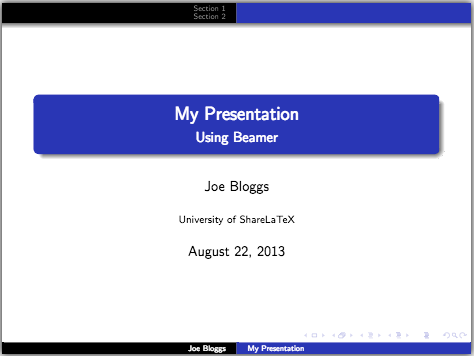
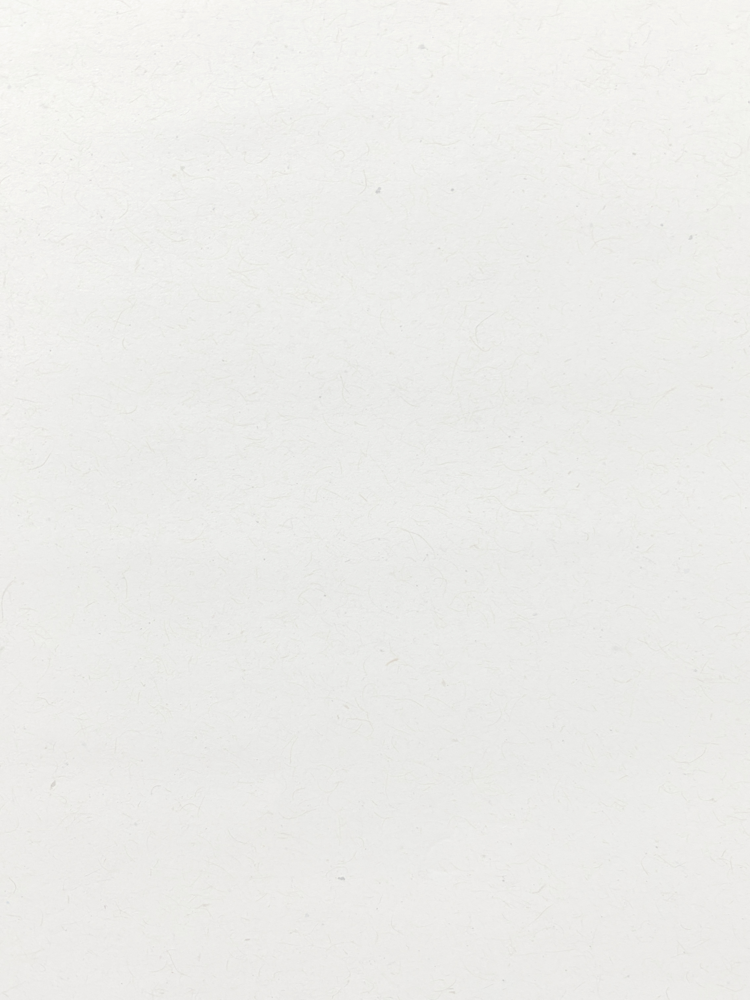

# NOBEAMER GUIDELINES

This document serves as both a demo and a guideline for the `nobeamer` theme.
Follow these rules to create beautiful, handwritten-style presentations.


---

## 1. Typography & Readability

Normal text for reading. The design focuses on **contrast** and _readability_.

- List item one
- List item two
  - Subitem
- List item three

1. Ordered list
2. Second item


---

# Titles **strong** _italics_

## Subtitles **strong** _italics_

### Sub-subtitles **strong** _italics_

#### Sub-sub-subtitles **strong** _italics_

```markdown
# Title
## Subtitle
### Sub-subtitle
#### Sub-sub-subtitle
```



---

## 2. Using Standard Cards

> Use standard blockquotes for **informal remarks** or "teacher's voice".
> This style mimics a handwritten note and should be used to break the flow of formal content.

```markdown
> This is the standard style...
```

---

## 3. Specialized Cards

### Information

Use emojis to call attention to the card.
Suggestions: (💡, 💁, ℹ️, 📝, 📚, 📖)

> [](#i) ℹ️ **Information**
> Use the **Info Card** for tips, side notes, or context that isn't critical but helpful.

```markdown
> [](#i) 💁 **Useful Tip**
> Content...
```

---

### Alert

Emoji suggestions: (⚠️, 📢, 🚨, ‼️, ⛔, ☠️)

> [](#a) ⚠️ **Warning**
> Use the **Alert Card** sparingly for critical warnings or common pitfalls.

```markdown
> [](#a) 📢 **Caution**
> Content...
```

---

### Success

Emoji suggestions: (✅, 🏆, ✔️, 🥇, 🎉, 🥳, 🚀)

> [](#s) 🎉 **Success / Solution**
> Use the **Success Card** for correct answers, conclusions, or good practices.

```markdown
> [](#s) 🎉 **Correct Result**
> Content...
```

---

### Dark Block

> [](#d) **Dark Block**
> Use the **Dark Block** for highlighted text.

```markdown
> [](#d) **Dark Block**
> Content...
```

---

## 4. Data Presentation

The standard boring table...

| Statistic | Value(g) | Description |
| :--- | ---: | :--- |
| Mean | 100.0 | Expected value |
| Deviation | 10.0 | Dispersion |
| Z-Score | 2.5 | Significant |

---

## 5. Code Presentation

I know we all love dark mode, but not for presentations.

```python
def hello():
    print("Hello Marp!")

if __name__ == "__main__":
    hello()
```

---

## 6. Math & Formulas

- For long math resolutions, use the `math-resolution` class.
- In this case, `div` tag is necessary.

<div class="math-resolution">

$$
\begin{aligned}
    P(X \le x) &= \sum_{i=0}^x \binom{n}{i} p^i (1-p)^{n-i} \\
    &= \binom{10}{2} 0.5^2 (0.5)^8 + \dots
\end{aligned}
$$

</div>

```html
<div class="math-resolution">
$$ \begin{aligned} ... \end{aligned} $$
</div>
```

---

## 7. Imagery Guidelines

### Full Background

<!-- _backgroundImage: URL("images/light_desk.jpg") -->


- Use full backgrounds for **section breaks** or impactful openers.
- Here, `` creates a fake margin, avoiding the one side of the image.

```markdown
<!-- _backgroundImage: URL("images/image.jpg") -->

```

---

### Side background

Choose a beautiful image to fill the side of the slide.

> [](#i) **Empty Space**
> Use side background to avoid empty white spaces.

```markdown

```


---

### Side background (Right)

... but right
Content comes first

> [](#i) **Monotony**
> Alter the position of the image to avoid monotony.

```markdown

```

>"The function of beauty is to be beautiful."


---

### Framed figure

Easy way to layout a figure that doesn't fit as a borderless figure.

```markdown

```


---

## Inline figure

- Text flows naturally around inline figures.
- Use for panoramic images only.

```markdown

```



---

<!-- _class: cols-2 -->

## Multi-column layout

### Left Column

Template:

```markdown
<!-- _class: cols-2 -->
# Title (spans both)
Left content...

Right content...
```

table sample

|Age|Weight|Name|
|---:|---:|:---:|
|20|80|John|
|21|81|Jane|


### Right Column

- `h1` spans both columns.
- Content flows automatically to the left column.
- Use `` to force a column break.

> [](#d) **Feature A**
>
> Minimal dark block with `highlighted` text.

---

<!-- _class: cols-3 -->

## 3-Column Layout

### Col 1

Starts here.

- Item A
- Item B

> [](#a) **Attention**
> `alert`, `info` and `success` blocks fit only on first column.


### Col 2

Middle column.

> [](#d) **Feature B**
>
> Minimal dark block with `highlighted` text.


### Col 3

Right column.

```markdown
<!-- _class: cols-3 -->
# Title
Col 1

Col 2

Col 3
```

---

<!-- _class: cols-3 -->

### Proto-Bento Layout

Some regular text in the column flow.

> [](#d) **Feature A**
>
> Minimal dark block with `highlighted` text.

More stuff here

```C
int main() {
    return 0;
}
```


> [](#d) you don't need to use
> dark blocks,
> just for fun.

<br>


Look at the image above.
What a mess!


| Statistic | Value(g) | Description |
| :--- | ---: | :--- |
| Mean | 100.0 | Expected value |
| Deviation | 10.0 | Dispersion |
| Z-Score | 2.5 | Significant |

I could kill minutes in this single slide.

> [](#d) As long as you keep the blocks **misaligned**, it will look less like a grid.

---
<!-- _class: cols-2 -->

## Syllabus

Our course is divided into 4 main constructive axes.

> [](#step) 🌐 **Unit I: Fundamentals**
> Web fundamentals and concepts, Client-Server architecture, and APIs (Leveling up on the Internet).


> [](#step) 🐍 **Unit II: Python APIs**
> Practical development of RESTful APIs using Python frameworks (such as FastAPI/Flask).


> [](#step) ⚡ **Unit III: Optimization**
> Optimization in Python using the revolutionary **Google OR-Tools** library (Linear, Integer, and Constraint Programming).

> [](#step) 🚀 **Unit IV: Integration**
> We will unite the Web layer with the optimization super powers in our big final project.
